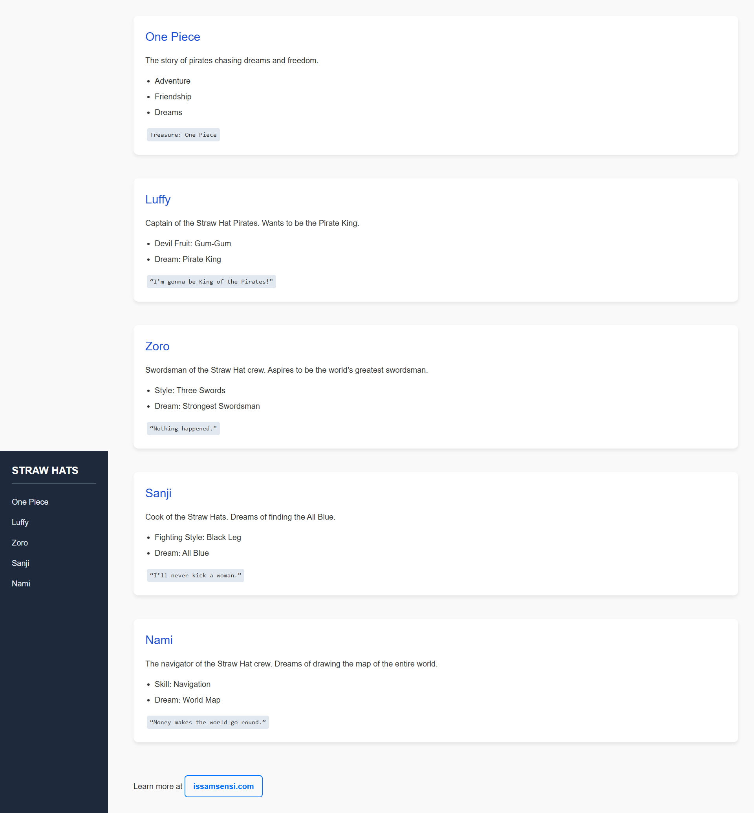

# One Piece Wiki 📚🏴‍☠️ 

A stylish, responsive mini-wiki dedicated to the world of **One Piece** and the Straw Hat Pirates. This project demonstrates semantic HTML, modern CSS, and a sidebar navigation layout, making it a great example for portfolios and web learning.

---

## Table of Contents
- [About](#about)
- [Features](#features)
- [Technologies Used](#technologies-used)
- [Screenshot](#screenshot)
- [Demo](#demo)
- [Installation](#installation)
- [Usage](#usage)
- [Contributing](#contributing)
- [License](#license)
- [Links](#links)

---

## About

This mini-wiki introduces the main characters of **One Piece**—Luffy, Zoro, Sanji, and Nami—along with their dreams and unique traits. The project features a fixed sidebar for navigation and a clean, card-style layout for each character section.

---

## Features

- Sidebar navigation for quick access
- Responsive and modern design
- Character sections with quotes and details
- Semantic HTML5 structure
- Clean, accessible, and easy to customize

---

## Technologies Used

- HTML5
- CSS3 (Flexbox, Shadows, Responsive Design)

---

## Screenshot

---

## Demo

[Live Demo](#) <!-- Replace # with your deployed URL if available -->

---

## Installation

1. Copy or download the `one-piece` folder to your project directory.
2. Open `index.html` in your web browser.

---

## Usage

- Browse the wiki to learn about the Straw Hat Pirates.
- Customize the content, styles, or images as desired for your own wiki or project.

---

## Contributing

Contributions are welcome! Please fork the repository and submit a pull request for improvements or new features.

---

## License

This project is licensed under the MIT License.

---

## Links

- [Learn more about One Piece](https://en.wikipedia.org/wiki/One_Piece)
- [GitHub Profile](https://github.com/issamsensi)
